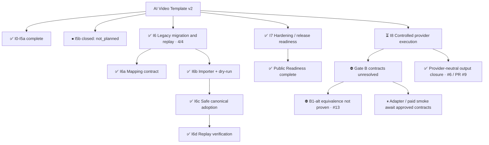

# Project Progress — AI Video Template v2

Derived coordination view. Canonical project truth and execution semantics remain unchanged.

Last verified: 2026-10-01

## Current milestone / phase

- Phase: **I8 — Controlled Provider Execution — IN PROGRESS** ([#4](https://github.com/rayray12zx3-sys/ai-video-template/issues/4))
- Completed baseline: **I0–I7**; I7 Public Readiness remains complete.
- I6 phase-task progress: **4 / 4 (100%) — COMPLETE**
- Verification progress: **I6a–I6d complete; local CI-equivalent verification is documented**
- Current item: **Gate B — execution-contract resolution** ([#5](https://github.com/rayray12zx3-sys/ai-video-template/issues/5))
- Current validation mode: GitHub Actions for hosted checks; record local CI-equivalent verification separately
- Downstream dependency blocks: none for I7 closeout
- I6 exit: satisfied; legacy migration and replay phase complete

## I8 current gate and evidence

GitHub Issues define scope and decisions; merged PRs and inspected runtime/test evidence define implementation and verification. This view does not approve an execution surface or spend.

| Item | Current state | Evidence / blocker |
| --- | --- | --- |
| Gate B | BLOCKED — execution contract unresolved | [#5](https://github.com/rayray12zx3-sys/ai-video-template/issues/5); workspace, spend and receipt requirements remain independent |
| B1 maintained Plugin path | BLOCKED | [#12](https://github.com/rayray12zx3-sys/ai-video-template/issues/12); vendor-supported maintained source/extension/deployment path not established |
| B1-alt managed/private CLI equivalence | BLOCKED — equivalence not proven | [#13](https://github.com/rayray12zx3-sys/ai-video-template/issues/13); 3 CLI-native lookup controls, 8 reproducible repo/local controls, 9 safety-relevant UNKNOWN controls; direct production CLI not approved |
| B2 spend | BLOCKED | #5 Decision B retains the provider-enforced-only guard; no approved exact-request cost bound |
| Receipt/reconciliation evidence | UNKNOWN / unresolved | #5 Decision C; independent workspace/task/asset/charged-refunded linkage remains unproven |
| Provider-neutral output closure | COMPLETE | [#6](https://github.com/rayray12zx3-sys/ai-video-template/issues/6) closed; [PR #9](https://github.com/rayray12zx3-sys/ai-video-template/pull/9) merged into inspected main `d7f61b86f9434a823b0f5e81f72191ab08828ac3` |
| Live adapter and paid smoke | NOT STARTED | Await approved Gate B contracts and exact human spend authorization |

Issue #13 validation: Plugin 1.3.2 / managed CLI 1.4.5 / Node 24.19.0 / Python 3.12.14. Fifteen local offline diagnostic/contract tests passed with zero real subprocess/socket attempts. The final allowlisted live probe used 11 read-only processes; account selector binding worked, active workspace stayed unchanged, and runtime/source hashes stayed unchanged. Slots/usage independent workspace evidence and paid transport/retry/receipt semantics remain unproven. This is not a full B1 acceptance PASS or a GitHub Actions result.

In the enumerated #13 probes/tests, no create/upload/generate/dispatch/credit-consuming invocation or workspace switch ran. No production adapter, guard, schema, Plugin or runtime files changed. Documentation synchronization is coordination evidence only.

- Active path: I8 → Gate B → B1-alt result → evidence/source resolution.
- REQUIRED_NOW: resolve the existing workspace/spend/receipt contract requirements in #4/#5; no new milestone denominator is introduced.
- DISCOVERY: exact-runtime no-retry and parameter/receipt evidence, or a maintained supported Plugin path, within the existing no-spend boundary.
- Next action: obtain those specific missing contracts or safe existing samples; preserve the Plugin-managed target while equivalence remains unproven.
- Exit condition: #5 accepts a proven execution surface, safe spend contract and trusted receipt requirements before adapter coding or paid smoke.
- I8 progress percentage: N/A; the parent acceptance checklist has not been re-evaluated into a completion count.

## Compressed progress tree



## Active path

```text
I0–I7  ✅ COMPLETE
I8     ⏳ Controlled provider execution
├─ Gate B  ⛔ BLOCKED: workspace / spend / receipt contracts
│  ├─ B1 maintained Plugin source/deployment  ⛔ #12
│  ├─ B1-alt direct managed CLI equivalence  ⛔ #13
│  ├─ B2 provider-enforced cost cap  ⛔ #5
│  └─ Receipt evidence  UNKNOWN / unresolved
├─ Provider-neutral output closure  ✅ #6 / PR #9
└─ Live adapter / paid smoke  ⏸ Await approved contracts
```

## Evidence mapping

| Item | State | Evidence |
| --- | --- | --- |
| I6a | COMPLETE | Mapping contract completed |
| I6b | COMPLETE | Deterministic importer and dry-run completed; Windows 3.11/3.14 CI verified |
| I6c | COMPLETE | State Engine adoption and checkpoint behavior completed; Windows 3.11/3.14 CI verified |
| I6d | COMPLETE | Five-case sanitized replay; local Windows 3.11/3.14 CI-equivalent verification passed |
| I7 | COMPLETE | Clean public canonical repository, public CI, PR smoke, branch protection, and security configuration complete |

## Scope discipline

- I6 is **4/4 complete**; this does not mean the entire project is released.
- I5b is shown as closed/not_planned and is not counted as completed I6 work.
- I6 remains complete; follow-up work is tracked under the phase that owns it.
- GitHub Projects remains coordination-only and does not override Issue scope or repository architecture policy.


## I7 release-readiness gate

Before I7 closes:

- current repository content must satisfy the public/private boundary
- full Git history and GitHub metadata exposure must be audited
- public contribution/security policies must be present
- public CI must be safe for untrusted fork Pull Requests
- repository security and branch-protection settings must meet the release policy
- final validation must run against the release-candidate commit
- public distribution must be created from the sanitized tree with **fresh Git history**; inherited private/archive history must never be published

## I7 readiness evidence

- Legacy behavior is generalized and covered by deterministic fixtures and regression tests.
- Windows Python 3.13.14 compileall and unit tests passed (117 tests, 1 skipped); this does not replace the required Python 3.11/3.14 verification.
- Public-tree inventory: 93 PUBLIC, 0 SANITIZE, 0 PRIVATE-REMOVE. History, GitHub metadata, licensing, and final release checks remain separate from this current-tree classification.
- Public CI remains provider-offline and does not authenticate or perform paid generation.
- Publication provenance is fail-closed: the sanitized tree may be exported, but inherited private Git history and hosting metadata are not publication inputs.


## I7 closeout

I7 is complete.

Closeout evidence:

- clean public canonical repository with fresh Git history
- initial public root commit uses GitHub noreply identity
- 93 tracked files, all classified PUBLIC
- Apache License 2.0
- Windows Python 3.11 public CI PASS
- Windows Python 3.14 public CI PASS
- pull-request CI smoke PASS
- public CI remains provider-offline and uses GitHub-hosted runners
- main branch protection requires PRs, required CI, up-to-date branches, conversation resolution, and linear history
- force pushes and branch deletion are blocked
- administrator bypass is disabled
- required approvals remain 0 for solo-maintainer operation
- Private Vulnerability Reporting, Dependabot protections, CodeQL default setup, and Push protection are enabled
- untrusted-fork safety is fail-closed by workflow design: no provider secrets, no paid execution, no self-hosted runners, no pull_request_target

The public canonical repository is now the active development repository. The former private repository remains archive/ops evidence only.
