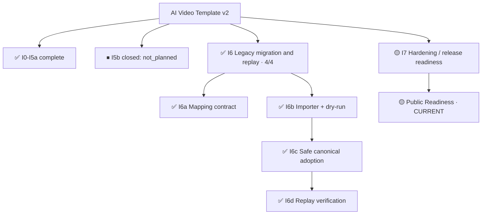

# Project Progress — AI Video Template v2

Derived coordination view. Canonical project truth and execution semantics remain unchanged.

Last verified: 2026-09-30

## Current milestone / phase

- Phase: **I7 — Hardening and release readiness**
- I6 phase-task progress: **4 / 4 (100%) — COMPLETE**
- Verification progress: **I6a–I6d complete; local CI-equivalent verification is documented**
- Current item: **I7 — Public Readiness**
- Current validation mode: GitHub Actions for hosted checks; record local CI-equivalent verification separately
- Downstream dependency blocks: I7 closeout requires the remaining readiness gates below
- I6 exit: satisfied; legacy migration and replay phase complete

## Compressed progress tree



## Active path

```text
I6  ✅ COMPLETE
├─ I6a mapping contract  ✅
├─ I6b importer + dry-run  ✅
├─ I6c safe canonical adoption  ✅
└─ I6d replay verification  ✅
   └─ I7 hardening / release readiness
      └─ Public Readiness  ← CURRENT
```

## Evidence mapping

| Item | State | Evidence |
| --- | --- | --- |
| I6a | COMPLETE | Mapping contract completed |
| I6b | COMPLETE | Deterministic importer and dry-run completed; Windows 3.11/3.14 CI verified |
| I6c | COMPLETE | State Engine adoption and checkpoint behavior completed; Windows 3.11/3.14 CI verified |
| I6d | COMPLETE | Five-case sanitized replay; local Windows 3.11/3.14 CI-equivalent verification passed |
| I7 | ACTIVE | Hardening and release-readiness work is current |

## Scope discipline

- I6 is **4/4 complete**; this does not mean the entire project is released.
- I5b is shown as closed/not_planned and is not counted as completed I6 work.
- I6 remains complete; follow-up work is tracked under the phase that owns it.
- GitHub Projects remains coordination-only and does not override Issue scope or repository architecture policy.


## I7 release-readiness gate

Before I7 closes:

- current repository content must satisfy the public/private boundary
- full Git history and GitHub metadata exposure must be audited
- public contribution/security policies must be present
- public CI must be safe for untrusted fork Pull Requests
- repository security and branch-protection settings must meet the release policy
- final validation must run against the release-candidate commit
- public distribution must be created from the sanitized tree with **fresh Git history**; inherited private/archive history must never be published

## I7 readiness evidence

- Legacy behavior is generalized and covered by deterministic fixtures and regression tests.
- Windows Python 3.13.14 compileall and unit tests passed (117 tests, 1 skipped); this does not replace the required Python 3.11/3.14 verification.
- Public-tree inventory: 93 PUBLIC, 0 SANITIZE, 0 PRIVATE-REMOVE. History, GitHub metadata, licensing, and final release checks remain separate from this current-tree classification.
- Public CI remains provider-offline and does not authenticate or perform paid generation.
- Publication provenance is fail-closed: the sanitized tree may be exported, but inherited private Git history and hosting metadata are not publication inputs.
